# vLLM V1 Continuous Batching 流程图

当前 V1 `Scheduler.schedule()` 如何统一调度 prompt 与 output token：先扫描 `running`，再从 `waiting` / `skipped_waiting` 接纳请求，构造一个可混合 Prefill 与 Decode 的 `SchedulerOutput`。图中标出双预算、KV 抢占、prefix cache、chunked prefill、`schedule` 返回前的乐观推进；PP / async 下后续 `schedule` 可与本张工单 GPU 交叠，本张工单 GPU 完成后才 `update_from_output`，再回到 EngineCore 主循环。

```mermaid
%%{init: {
  "theme": "base",
  "themeVariables": {
    "background": "#FFFFFF",
    "primaryColor": "#E3F2FD",
    "primaryTextColor": "#102A43",
    "primaryBorderColor": "#1565C0",
    "lineColor": "#455A64",
    "secondaryColor": "#FFF8E1",
    "tertiaryColor": "#E8F5E9",
    "fontSize": "15px"
  },
  "flowchart": {
    "curve": "linear",
    "nodeSpacing": 28,
    "rankSpacing": 40,
    "padding": 12,
    "htmlLabels": true
  }
}}%%
flowchart TB
    classDef startend fill:#FFF8E1,stroke:#F9A825,color:#102A43,stroke-width:2px
    classDef queue fill:#E8F5E9,stroke:#2E7D32,color:#102A43,stroke-width:2px
    classDef proc fill:#E3F2FD,stroke:#1565C0,color:#102A43,stroke-width:2px
    classDef decision fill:#FFFFFF,stroke:#2E7D32,color:#102A43,stroke-width:2px
    classDef skip fill:#F5F5F5,stroke:#78909C,color:#455A64,stroke-width:2px
    classDef preempt fill:#FFEBEE,stroke:#C62828,color:#102A43,stroke-width:2px
    classDef out fill:#F3E5F5,stroke:#7B1FA2,color:#102A43,stroke-width:2px
    classDef bridge fill:#FFFFFF,stroke:#90A4AE,color:#102A43,stroke-width:2px

    arrive(["新请求到达"]):::startend --> enqueue["按状态进入 waiting 或 skipped_waiting<br/>队列按 FCFS / priority 排序"]:::queue
    enqueue --> hasWork{"还有未完成请求<br/>或在途批次?"}:::decision
    hasWork -->|否| idle(["EngineCore 等待新请求"]):::startend
    hasWork -->|是| initBudget["Scheduler.schedule<br/>token_budget = max_num_scheduled_tokens<br/>input_budget = max_num_batched_tokens"]:::proc
    initBudget --> runningGate

    subgraph RUNNING ["第一段：扫描 running"]
        runningGate{"running 未扫完<br/>且两类预算仍可用?"}:::decision
        runningGate -->|是| takeRunning["取下一条 running"]:::proc
        takeRunning --> earlySkip{"本步先跳过?<br/>PP+async 未到可 Decode 步<br/>DP 推迟这块 Prefill<br/>async 已打满 max_tokens"}:::decision
        earlySkip -->|是| skipRunning["跳过，继续扫后面的 running"]:::skip
        skipRunning --> runningGate
        earlySkip -->|否| planRunning["need = num_tokens_with_spec + placeholders − computed<br/>再按预算、长度、encoder 截断"]:::proc
        planRunning --> runningSchedulable{"最终 num_new_tokens 大于 0?"}:::decision
        runningSchedulable -->|否：欠 0 / 等采样等| skipRunning
        runningSchedulable -->|是| allocRunning{"allocate_slots 成功?"}:::decision
        allocRunning -->|是| recordRunning["记录请求与 token 数，扣减两类预算"]:::proc
        recordRunning --> runningGate
        allocRunning -->|否| preempt["抢占 victim：释放 KV、computed 清零、放回 waiting<br/>必要时恢复本批已占预算"]:::preempt
        preempt --> currentPreempted{"当前请求也被抢占?"}:::decision
        currentPreempted -->|否：重试分配| allocRunning
        currentPreempted -->|是| runningDone["停止扫描 running"]:::skip
        runningGate -->|否| runningDone
    end

    runningDone --> phase2["running 扫完，进入第二段"]:::bridge
    phase2 --> waitingGate

    subgraph WAITING ["第二段：接纳 waiting / skipped_waiting"]
        waitingGate{"本轮没有抢占、队列非空<br/>预算可用且 running slot 未满?"}:::decision
        waitingGate -->|是| takeWaiting["按策略选择队头请求"]:::proc
        takeWaiting --> skippableBlocker{"存在可暂时跳过的阻塞?<br/>远程 KV / grammar 未就绪<br/>LoRA 上限 / stale output 等"}:::decision
        skippableBlocker -->|是| skipWaiting["放入本轮 skipped 集合，继续看下一条"]:::skip
        skipWaiting --> waitingGate
        skippableBlocker -->|否| prefixPlan["必要时查本地 / 外部 prefix cache<br/>确定 computed；按预算截断，允许时做 chunked prefill"]:::proc
        prefixPlan --> asyncLoad{"需要异步加载远程 KV?"}:::decision
        asyncLoad -->|是| allocRemote{"allocate_slots 成功?<br/>异步加载同样要预留 KV"}:::decision
        allocRemote -->|是| waitRemote["设为 WAITING_FOR_REMOTE_KVS<br/>本轮不执行 forward"]:::skip
        waitRemote --> waitingGate
        allocRemote -->|否| stopWaiting["停止扫描 waiting，本轮不再接纳新请求"]:::skip
        asyncLoad -->|否| admitWaiting{"num_new_tokens 大于 0<br/>且 allocate_slots 成功?"}:::decision
        admitWaiting -->|是| recordWaiting["移入 running，记录 token 数并扣预算"]:::proc
        recordWaiting --> waitingGate
        admitWaiting -->|否：资源不足或不可切分| stopWaiting
        waitingGate -->|否| waitingDone["结束接纳 waiting"]:::skip
        stopWaiting --> waitingDone
    end

    waitingDone --> schedulerOutput["生成 SchedulerOutput<br/>谁参加、每人几个 token、KV 格子<br/>同一批可混合 Prefill 与 Decode"]:::out
    schedulerOutput --> optimisticAdvance["_update_after_schedule（仍在 schedule 内）<br/>乐观增加 computed / in-flight"]:::proc

    optimisticAdvance --> executeBatch
    optimisticAdvance --> queueCheck{"PP / async 且 batch queue 未满<br/>并且还有请求可排?"}:::decision
    queueCheck -->|是：立刻再 schedule<br/>不必等本张 GPU 跑完| initBudget

    subgraph EXECUTION ["本张工单交给 GPU 之后"]
        executeBatch["Worker / GPU 执行本张工单<br/>可与后续 schedule 交叠<br/>只在可采样位置 sampling"]:::proc
        executeBatch --> updateOutput["这张工单 GPU 完成后才 update_from_output<br/>清 in-flight、处理 spec 回滚、接上采样"]:::proc
        updateOutput --> requestFinished{"对每个已调度请求，是否已经结束?"}:::decision
        requestFinished -->|是| release["移出 running，释放 KV / encoder cache"]:::proc
        requestFinished -->|否| keepRunning["留在 running，下一轮再按已知 − 已算补齐"]:::queue
        release --> nextIteration["本批结算完，回到 EngineCore 主循环"]:::out
        keepRunning --> nextIteration
    end

    nextIteration --> hasWork

    style RUNNING fill:#F8FAFC,stroke:#90A4AE,stroke-width:2px
    style WAITING fill:#F8FAFC,stroke:#90A4AE,stroke-width:2px
    style EXECUTION fill:#FAFAFA,stroke:#90A4AE,stroke-width:2px
    linkStyle default stroke:#455A64,stroke-width:2px
```

