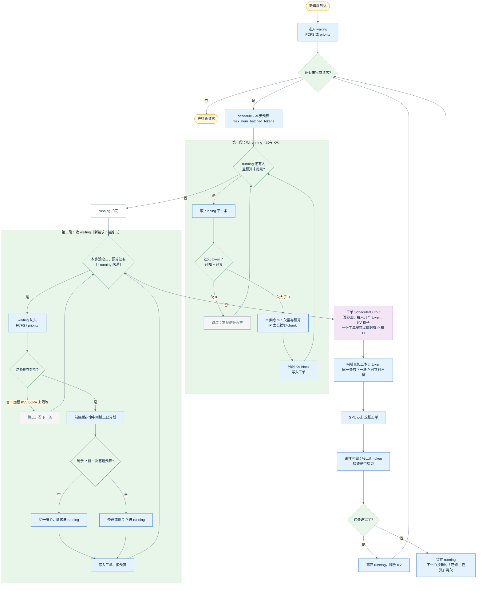

# vLLM Continuous Batching 流程图

V1 `Scheduler.schedule()` 如何把 `waiting` / `running` 里的请求填进一张工单（`SchedulerOutput`）。先扫 running，再收 waiting；一张工单里可以同时有 P 和 D，P 太长就切 chunk。

```mermaid
%%{init: {
  "theme": "base",
  "themeVariables": {
    "primaryColor": "#E3F2FD",
    "primaryTextColor": "#102A43",
    "primaryBorderColor": "#1565C0",
    "lineColor": "#546E7A",
    "secondaryColor": "#FFF8E1",
    "tertiaryColor": "#E8F5E9",
    "fontSize": "16px"
  },
  "flowchart": {
    "curve": "basis",
    "nodeSpacing": 32,
    "rankSpacing": 56,
    "padding": 18,
    "htmlLabels": true
  }
}}%%
flowchart TB
    classDef startend fill:#FFF8E1,stroke:#F9A825,color:#102A43
    classDef proc fill:#E3F2FD,stroke:#1565C0,color:#102A43
    classDef decision fill:#E8F5E9,stroke:#2E7D32,color:#102A43
    classDef skip fill:#F5F5F5,stroke:#90A4AE,color:#546E7A
    classDef out fill:#F3E5F5,stroke:#7B1FA2,color:#102A43
    classDef bridge fill:#FFFFFF,stroke:#90A4AE,color:#102A43

    arrive([新请求到达]):::startend --> waiting[进入 waiting<br/>FCFS 或 priority]:::proc
    waiting --> more{还有未完成请求?}:::decision
    more -->|否| idle([等待新请求]):::startend
    more -->|是| budget[schedule：本步预算<br/>max_num_batched_tokens]:::proc
    budget --> runQ

    subgraph RUN ["第一段：扫 running（已有 KV）"]
        direction TB
        runQ{running 还有人<br/>且预算未用完?}:::decision
        runQ -->|是| takeRun[取 running 下一条]:::proc
        takeRun --> debt{还欠 token？<br/>已知 − 已算}:::decision
        debt -->|欠 0| skipRun[跳过：常见是等采样]:::skip
        skipRun --> runQ
        debt -->|欠大于 0| chunk[本步给 min 欠量与预算<br/>P 太长就切 chunk]:::proc
        chunk --> alloc[分配 KV block<br/>写入工单]:::proc
        alloc --> runQ
    end

    runQ -->|否| bridge1[running 扫完]:::bridge
    bridge1 --> waitGate

    subgraph WAIT ["第二段：收 waiting（新请求 / 被抢占）"]
        direction TB
        waitGate{本步没抢占、预算还有<br/>且 running 未满?}:::decision
        waitGate -->|是| takeWait[waiting 队头<br/>FCFS / priority]:::proc
        takeWait --> canSched{这条现在能排?}:::decision
        canSched -->|否：远程 KV / LoRA 上限等| skipW[跳过，看下一条]:::skip
        skipW --> waitGate
        canSched -->|是| cache[前缀缓存命中则跳过已算段]:::proc
        cache --> fit{剩余 P 能一次塞进预算?}:::decision
        fit -->|否| chunkW[切一块 P，请求进 running]:::proc
        fit -->|是| admit[整段或剩余 P 进 running]:::proc
        chunkW --> writeW[写入工单、扣预算]:::proc
        admit --> writeW
        writeW --> waitGate
    end

    waitGate -->|否| ticket[工单 SchedulerOutput<br/>谁参加、每人几个 token、KV 格子<br/>一张工单里可以同时有 P 和 D]:::out
    ticket --> advance[指针先加上本步 token<br/>同一条的下一块 P 可立刻再排]:::proc
    advance --> gpu[GPU 执行这张工单]:::proc
    gpu --> back[采样写回：接上新 token<br/>检查是否结束]:::proc
    back --> done{这条说完了?}:::decision
    done -->|是| leave[离开 running，释放 KV]:::proc
    done -->|否| stay[留在 running<br/>下一拍按新的「已知 − 已算」再欠]:::proc
    leave --> more
    stay --> more
```
