# vLLM PP 调度依赖与流水线占用

该图来自 `test_pp_pipeline_occupancy.py` 的受控场景：PP=2、同步调度、
`max_num_batched_tokens=16`。batch 内容由真实 V1 Scheduler 决定；每个格子
使用一个理想化 stage 时间单位，只表达执行顺序，不代表实测 GPU 耗时。

- `P`：非最后一个 chunked prefill chunk，不产生采样 token。
- `PF`：final prefill chunk，完成后产生该请求的第一个输出 token `y1`。
- `D1`：消费 `y1` 并产生 `y2`；`D2` 消费 `y2` 并产生 `y3`。
- Prefill chunk 可以在前一 chunk 离开整个流水线之前被调度，但在每个 PP
  stage 上必须保持 KV 顺序；decode 必须等待前一步采样 token 返回 Scheduler。

```mermaid
%%{init: {
  "theme": "base",
  "themeVariables": {
    "primaryColor": "#E3F2FD",
    "primaryTextColor": "#102A43",
    "primaryBorderColor": "#1565C0",
    "lineColor": "#546E7A",
    "secondaryColor": "#FFF8E1",
    "tertiaryColor": "#ECEFF1"
  },
  "flowchart": {
    "htmlLabels": true,
    "nodeSpacing": 22,
    "rankSpacing": 30,
    "padding": 8,
    "curve": "linear"
  }
}}%%
flowchart TB
    classDef prefill fill:#E3F2FD,stroke:#1565C0,color:#102A43,stroke-width:1px
    classDef finalPrefill fill:#E8F5E9,stroke:#2E7D32,color:#102A43,stroke-width:2px
    classDef decode fill:#FFF3E0,stroke:#EF6C00,color:#102A43,stroke-width:2px
    classDef bubble fill:#F5F5F5,stroke:#B0BEC5,color:#78909C,stroke-width:1px,stroke-dasharray:4 3
    classDef note fill:#FFFDE7,stroke:#F9A825,color:#5D4037,stroke-width:1px

    semantics["依赖语义<br/>P/PF：后一 chunk 可提前 issue，但每个 stage 上不能越过前一 chunk<br/>PF → y1 → D1，D1 → y2 → D2：必须等采样 token 返回 Scheduler"]:::note

    subgraph single["单请求 A：prompt=24，max_tokens=3"]
        direction LR
        subgraph s0["t0"]
            direction TB
            s00["PP0<br/>B0 A P[0:16]"]:::prefill
            s01["PP1<br/>空：pipeline fill"]:::bubble
        end
        subgraph s1["t1"]
            direction TB
            s10["PP0<br/>B1 A PF[16:24]"]:::finalPrefill
            s11["PP1<br/>B0 A P[0:16]"]:::prefill
        end
        subgraph s2["t2"]
            direction TB
            s20["PP0<br/>空：等 y1"]:::bubble
            s21["PP1<br/>B1 A PF[16:24]<br/>完成后采样 y1"]:::finalPrefill
        end
        subgraph s3["t3"]
            direction TB
            s30["PP0<br/>B2 A D1，输入 y1"]:::decode
            s31["PP1<br/>空"]:::bubble
        end
        subgraph s4["t4"]
            direction TB
            s40["PP0<br/>空：等 y2"]:::bubble
            s41["PP1<br/>B2 A D1<br/>完成后采样 y2"]:::decode
        end
        subgraph s5["t5"]
            direction TB
            s50["PP0<br/>B3 A D2，输入 y2"]:::decode
            s51["PP1<br/>空"]:::bubble
        end
        subgraph s6["t6"]
            direction TB
            s60["PP0<br/>空：pipeline drain"]:::bubble
            s61["PP1<br/>B3 A D2<br/>完成后采样 y3"]:::decode
        end
        s0 --> s1 --> s2 --> s3 --> s4 --> s5 --> s6
    end

    s00 -.->|同一 stage 的 KV 顺序| s10
    s11 -.->|同一 stage 的 KV 顺序| s21
    s21 ==>|y1 返回后才能 issue| s30
    s41 ==>|y2 返回后才能 issue| s50

    subgraph mixed["多请求 continuous batching：A/B 等 token 时，Scheduler 把 C 排进空槽"]
        direction LR
        subgraph m0["t0"]
            direction TB
            m00["PP0<br/>B0 A P[0:16]"]:::prefill
            m01["PP1<br/>空"]:::bubble
        end
        subgraph m1["t1"]
            direction TB
            m10["PP0<br/>B1 A PF + B PF"]:::finalPrefill
            m11["PP1<br/>B0 A P[0:16]"]:::prefill
        end
        subgraph m2["t2"]
            direction TB
            m20["PP0<br/>B2 C PF"]:::finalPrefill
            m21["PP1<br/>B1 A PF + B PF<br/>→ yA1, yB1"]:::finalPrefill
        end
        subgraph m3["t3"]
            direction TB
            m30["PP0<br/>B3 A D1 + B D1"]:::decode
            m31["PP1<br/>B2 C PF<br/>→ yC1"]:::finalPrefill
        end
        subgraph m4["t4"]
            direction TB
            m40["PP0<br/>B4 C D1"]:::decode
            m41["PP1<br/>B3 A D1 + B D1<br/>→ yA2, yB2"]:::decode
        end
        subgraph m5["t5"]
            direction TB
            m50["PP0<br/>B5 A D2 + B D2"]:::decode
            m51["PP1<br/>B4 C D1<br/>→ yC2"]:::decode
        end
        subgraph m6["t6"]
            direction TB
            m60["PP0<br/>B6 C D2"]:::decode
            m61["PP1<br/>B5 A D2 + B D2<br/>→ yA3, yB3"]:::decode
        end
        subgraph m7["t7"]
            direction TB
            m70["PP0<br/>空：pipeline drain"]:::bubble
            m71["PP1<br/>B6 C D2<br/>→ yC3"]:::decode
        end
        m0 --> m1 --> m2 --> m3 --> m4 --> m5 --> m6 --> m7
    end

    semantics -->|先看单请求的因果依赖| single
    single -->|再加入其他请求填补等待槽| mixed

    style single fill:#FAFAFA,stroke:#90A4AE,stroke-width:2px
    style mixed fill:#FAFAFA,stroke:#90A4AE,stroke-width:2px
    linkStyle default stroke:#546E7A,stroke-width:1.5px
```

