# vLLM PP=4 多请求流水线占用

该图来自 `test_pp_pipeline_occupancy.py`：PP=4、同步调度、`max_num_batched_tokens=16`。
A prompt=24 与 B prompt=8 在 t0 到达，C prompt=8 在第一个 batch issue 之后到达；三条请求 `max_tokens=3`。

- C 能填 A/B 等采样时的 Prefill 空槽。
- 3 条请求仍填不满 4 级 Decode 气泡，PP0 在 Decode 阶段每次仍空 2 拍。
- busy 28/56，利用率 50%。

```mermaid
%% Trace assumptions:
%% - PP=4, synchronous scheduling, max_num_batched_tokens=16.
%% - Arrivals: A prompt=24 and B prompt=8 at t0; C prompt=8 after the first issued batch.
%% - Each cell is one explanatory stage-time unit, not measured GPU latency.
%%{init: {
  "theme": "base",
  "themeVariables": {
    "primaryColor": "#E3F2FD",
    "primaryTextColor": "#102A43",
    "primaryBorderColor": "#1565C0",
    "lineColor": "#546E7A",
    "secondaryColor": "#FFF8E1",
    "tertiaryColor": "#ECEFF1"
  },
  "flowchart": {
    "htmlLabels": true,
    "nodeSpacing": 20,
    "rankSpacing": 28,
    "padding": 8,
    "curve": "linear"
  }
}}%%
flowchart TB
    classDef prefill fill:#E3F2FD,stroke:#1565C0,color:#102A43,stroke-width:1px
    classDef finalPrefill fill:#E8F5E9,stroke:#2E7D32,color:#102A43,stroke-width:2px
    classDef decode fill:#FFF3E0,stroke:#EF6C00,color:#102A43,stroke-width:2px
    classDef bubble fill:#F5F5F5,stroke:#B0BEC5,color:#78909C,stroke-width:1px,stroke-dasharray:4 3
    classDef note fill:#FFFDE7,stroke:#F9A825,color:#5D4037,stroke-width:1px

    semantics["PP=4 mixed：C 能填 Prefill 空槽，但 3 条请求填不满 4 级 Decode 气泡<br/>busy 28/56，利用率 50%。Decode 仍须等采样返回"]:::note

    subgraph grid["多请求 A/B/C：continuous batching"]
        direction LR
        subgraph t0["t0"]
            direction TB
            m00["PP0<br/>B0 A P[0:16]"]:::prefill
            m01["PP1<br/>空：pipeline fill"]:::bubble
            m02["PP2<br/>空"]:::bubble
            m03["PP3<br/>空"]:::bubble
        end
        subgraph t1["t1"]
            direction TB
            m10["PP0<br/>B1 A PF[16:24] + B PF[0:8]"]:::finalPrefill
            m11["PP1<br/>B0 A P[0:16]"]:::prefill
            m12["PP2<br/>空"]:::bubble
            m13["PP3<br/>空"]:::bubble
        end
        subgraph t2["t2"]
            direction TB
            m20["PP0<br/>B2 C PF"]:::finalPrefill
            m21["PP1<br/>B1 A PF[16:24] + B PF[0:8]"]:::finalPrefill
            m22["PP2<br/>B0 A P[0:16]"]:::prefill
            m23["PP3<br/>空"]:::bubble
        end
        subgraph t3["t3"]
            direction TB
            m30["PP0<br/>空：等 yA1 / yB1"]:::bubble
            m31["PP1<br/>B2 C PF"]:::finalPrefill
            m32["PP2<br/>B1 A PF[16:24] + B PF[0:8]"]:::finalPrefill
            m33["PP3<br/>B0 A P[0:16]"]:::prefill
        end
        subgraph t4["t4"]
            direction TB
            m40["PP0<br/>空"]:::bubble
            m41["PP1<br/>空"]:::bubble
            m42["PP2<br/>B2 C PF"]:::finalPrefill
            m43["PP3<br/>B1 A PF[16:24] + B PF[0:8]<br/>→ yA1, yB1"]:::finalPrefill
        end
        subgraph t5["t5"]
            direction TB
            m50["PP0<br/>B3 A D1 + B D1"]:::decode
            m51["PP1<br/>空"]:::bubble
            m52["PP2<br/>空"]:::bubble
            m53["PP3<br/>B2 C PF<br/>→ yC1"]:::finalPrefill
        end
        subgraph t6["t6"]
            direction TB
            m60["PP0<br/>B4 C D1"]:::decode
            m61["PP1<br/>B3 A D1 + B D1"]:::decode
            m62["PP2<br/>空"]:::bubble
            m63["PP3<br/>空"]:::bubble
        end
        subgraph t7["t7"]
            direction TB
            m70["PP0<br/>空：等 yA2 / yB2"]:::bubble
            m71["PP1<br/>B4 C D1"]:::decode
            m72["PP2<br/>B3 A D1 + B D1"]:::decode
            m73["PP3<br/>空"]:::bubble
        end
        subgraph t8["t8"]
            direction TB
            m80["PP0<br/>空"]:::bubble
            m81["PP1<br/>空"]:::bubble
            m82["PP2<br/>B4 C D1"]:::decode
            m83["PP3<br/>B3 A D1 + B D1<br/>→ yA2, yB2"]:::decode
        end
        subgraph t9["t9"]
            direction TB
            m90["PP0<br/>B5 A D2 + B D2"]:::decode
            m91["PP1<br/>空"]:::bubble
            m92["PP2<br/>空"]:::bubble
            m93["PP3<br/>B4 C D1<br/>→ yC2"]:::decode
        end
        subgraph t10["t10"]
            direction TB
            m100["PP0<br/>B6 C D2"]:::decode
            m101["PP1<br/>B5 A D2 + B D2"]:::decode
            m102["PP2<br/>空"]:::bubble
            m103["PP3<br/>空"]:::bubble
        end
        subgraph t11["t11"]
            direction TB
            m110["PP0<br/>空：pipeline drain"]:::bubble
            m111["PP1<br/>B6 C D2"]:::decode
            m112["PP2<br/>B5 A D2 + B D2"]:::decode
            m113["PP3<br/>空"]:::bubble
        end
        subgraph t12["t12"]
            direction TB
            m120["PP0<br/>空"]:::bubble
            m121["PP1<br/>空"]:::bubble
            m122["PP2<br/>B6 C D2"]:::decode
            m123["PP3<br/>B5 A D2 + B D2<br/>→ yA3, yB3"]:::decode
        end
        subgraph t13["t13"]
            direction TB
            m130["PP0<br/>空"]:::bubble
            m131["PP1<br/>空"]:::bubble
            m132["PP2<br/>空"]:::bubble
            m133["PP3<br/>B6 C D2<br/>→ yC3"]:::decode
        end
        t0 --> t1 --> t2 --> t3 --> t4 --> t5 --> t6 --> t7 --> t8 --> t9 --> t10 --> t11 --> t12 --> t13
    end

    m00 -.->|同一 stage 的 KV 顺序| m10
    m43 ==>|yA1 / yB1 返回| m50
    m53 ==>|yC1 返回| m60
    m83 ==>|yA2 / yB2 返回| m90
    m93 ==>|yC2 返回| m100

    semantics --> grid
    style grid fill:#FAFAFA,stroke:#90A4AE,stroke-width:2px
    linkStyle default stroke:#546E7A,stroke-width:1.5px

```

