# vLLM PP=4 单请求流水线占用

该图来自 `test_pp_pipeline_occupancy.py`：PP=4、同步调度、`max_num_batched_tokens=16`。
请求 A 的 prompt=24、`max_tokens=3`。每个格子是一个理想化 stage 时间单位。

- `P`：非最后一个 chunked prefill，不采样。
- `PF`：final prefill，完成后采样 `y1`。
- `D1` / `D2`：必须等上一步采样 token 返回 Scheduler。
- 单请求时 PP0 在每次采样后空 `pp_size-1=3` 拍；busy 16/52，利用率约 31%。

```mermaid
%% Trace assumptions:
%% - PP=4, synchronous scheduling, max_num_batched_tokens=16.
%% - Each cell is one explanatory stage-time unit, not measured GPU latency.
%% - PF is the final prefill chunk; it samples the request's first output token.
%%{init: {
  "theme": "base",
  "themeVariables": {
    "primaryColor": "#E3F2FD",
    "primaryTextColor": "#102A43",
    "primaryBorderColor": "#1565C0",
    "lineColor": "#546E7A",
    "secondaryColor": "#FFF8E1",
    "tertiaryColor": "#ECEFF1"
  },
  "flowchart": {
    "htmlLabels": true,
    "nodeSpacing": 20,
    "rankSpacing": 28,
    "padding": 8,
    "curve": "linear"
  }
}}%%
flowchart TB
    classDef prefill fill:#E3F2FD,stroke:#1565C0,color:#102A43,stroke-width:1px
    classDef finalPrefill fill:#E8F5E9,stroke:#2E7D32,color:#102A43,stroke-width:2px
    classDef decode fill:#FFF3E0,stroke:#EF6C00,color:#102A43,stroke-width:2px
    classDef bubble fill:#F5F5F5,stroke:#B0BEC5,color:#78909C,stroke-width:1px,stroke-dasharray:4 3
    classDef note fill:#FFFDE7,stroke:#F9A825,color:#5D4037,stroke-width:1px

    semantics["PP=4 单请求：P→PF 可立刻 issue；PF→y1→D1、D1→y2→D2 必须等采样返回<br/>因此 PP0 每次采样后空 pp_size-1=3 拍。busy 16/52，利用率 31%"]:::note

    subgraph grid["单请求 A：prompt=24，max_tokens=3"]
        direction LR
        subgraph t0["t0"]
            direction TB
            a00["PP0<br/>B0 A P[0:16]"]:::prefill
            a01["PP1<br/>空：pipeline fill"]:::bubble
            a02["PP2<br/>空：pipeline fill"]:::bubble
            a03["PP3<br/>空：pipeline fill"]:::bubble
        end
        subgraph t1["t1"]
            direction TB
            a10["PP0<br/>B1 A PF[16:24]"]:::finalPrefill
            a11["PP1<br/>B0 A P[0:16]"]:::prefill
            a12["PP2<br/>空"]:::bubble
            a13["PP3<br/>空"]:::bubble
        end
        subgraph t2["t2"]
            direction TB
            a20["PP0<br/>空：等 y1"]:::bubble
            a21["PP1<br/>B1 A PF[16:24]"]:::finalPrefill
            a22["PP2<br/>B0 A P[0:16]"]:::prefill
            a23["PP3<br/>空"]:::bubble
        end
        subgraph t3["t3"]
            direction TB
            a30["PP0<br/>空"]:::bubble
            a31["PP1<br/>空"]:::bubble
            a32["PP2<br/>B1 A PF[16:24]"]:::finalPrefill
            a33["PP3<br/>B0 A P[0:16]"]:::prefill
        end
        subgraph t4["t4"]
            direction TB
            a40["PP0<br/>空"]:::bubble
            a41["PP1<br/>空"]:::bubble
            a42["PP2<br/>空"]:::bubble
            a43["PP3<br/>B1 A PF[16:24]<br/>完成后采样 y1"]:::finalPrefill
        end
        subgraph t5["t5"]
            direction TB
            a50["PP0<br/>B2 A D1，输入 y1"]:::decode
            a51["PP1<br/>空"]:::bubble
            a52["PP2<br/>空"]:::bubble
            a53["PP3<br/>空"]:::bubble
        end
        subgraph t6["t6"]
            direction TB
            a60["PP0<br/>空：等 y2"]:::bubble
            a61["PP1<br/>B2 A D1"]:::decode
            a62["PP2<br/>空"]:::bubble
            a63["PP3<br/>空"]:::bubble
        end
        subgraph t7["t7"]
            direction TB
            a70["PP0<br/>空"]:::bubble
            a71["PP1<br/>空"]:::bubble
            a72["PP2<br/>B2 A D1"]:::decode
            a73["PP3<br/>空"]:::bubble
        end
        subgraph t8["t8"]
            direction TB
            a80["PP0<br/>空"]:::bubble
            a81["PP1<br/>空"]:::bubble
            a82["PP2<br/>空"]:::bubble
            a83["PP3<br/>B2 A D1<br/>完成后采样 y2"]:::decode
        end
        subgraph t9["t9"]
            direction TB
            a90["PP0<br/>B3 A D2，输入 y2"]:::decode
            a91["PP1<br/>空"]:::bubble
            a92["PP2<br/>空"]:::bubble
            a93["PP3<br/>空"]:::bubble
        end
        subgraph t10["t10"]
            direction TB
            a100["PP0<br/>空：pipeline drain"]:::bubble
            a101["PP1<br/>B3 A D2"]:::decode
            a102["PP2<br/>空"]:::bubble
            a103["PP3<br/>空"]:::bubble
        end
        subgraph t11["t11"]
            direction TB
            a110["PP0<br/>空"]:::bubble
            a111["PP1<br/>空"]:::bubble
            a112["PP2<br/>B3 A D2"]:::decode
            a113["PP3<br/>空"]:::bubble
        end
        subgraph t12["t12"]
            direction TB
            a120["PP0<br/>空"]:::bubble
            a121["PP1<br/>空"]:::bubble
            a122["PP2<br/>空"]:::bubble
            a123["PP3<br/>B3 A D2<br/>完成后采样 y3"]:::decode
        end
        t0 --> t1 --> t2 --> t3 --> t4 --> t5 --> t6 --> t7 --> t8 --> t9 --> t10 --> t11 --> t12
    end

    a00 -.->|同一 stage 的 KV 顺序| a10
    a43 ==>|y1 返回后才能 issue| a50
    a83 ==>|y2 返回后才能 issue| a90

    semantics --> grid
    style grid fill:#FAFAFA,stroke:#90A4AE,stroke-width:2px
    linkStyle default stroke:#546E7A,stroke-width:1.5px

```

