# vLLM PP=4 调度依赖与流水线占用

该图来自 `test_pp_pipeline_occupancy.py` 的受控场景：PP=4、同步调度、
`max_num_batched_tokens=16`。batch 内容由真实 V1 Scheduler 决定；每个格子
使用一个理想化 stage 时间单位，只表达执行顺序，不代表实测 GPU 耗时。

- `P`：非最后一个 chunked prefill chunk，不产生采样 token。
- `PF`：final prefill chunk，完成后产生该请求的第一个输出 token `y1`。
- `D1`：消费 `y1` 并产生 `y2`；`D2` 消费 `y2` 并产生 `y3`。
- Prefill chunk 可以在前一 chunk 离开整个流水线之前被调度，但在每个 PP
  stage 上必须保持 KV 顺序；decode 必须等待前一步采样 token 返回 Scheduler。
- 与 PP=2 的差别：每次采样之后，PP0 会空 `pp_size-1=3` 拍。3 条请求能填
  Prefill 交错槽，但填不满 4 级 Decode 气泡，mixed 利用率约 50%。

```mermaid
%%{init: {
  "theme": "base",
  "themeVariables": {
    "primaryColor": "#E3F2FD",
    "primaryTextColor": "#102A43",
    "primaryBorderColor": "#1565C0",
    "lineColor": "#546E7A",
    "secondaryColor": "#FFF8E1",
    "tertiaryColor": "#ECEFF1"
  },
  "flowchart": {
    "htmlLabels": true,
    "nodeSpacing": 18,
    "rankSpacing": 26,
    "padding": 6,
    "curve": "linear"
  }
}}%%
flowchart TB
    classDef prefill fill:#E3F2FD,stroke:#1565C0,color:#102A43,stroke-width:1px
    classDef finalPrefill fill:#E8F5E9,stroke:#2E7D32,color:#102A43,stroke-width:2px
    classDef decode fill:#FFF3E0,stroke:#EF6C00,color:#102A43,stroke-width:2px
    classDef bubble fill:#F5F5F5,stroke:#B0BEC5,color:#78909C,stroke-width:1px,stroke-dasharray:4 3
    classDef note fill:#FFFDE7,stroke:#F9A825,color:#5D4037,stroke-width:1px

    semantics["PP=4 依赖语义<br/>P → PF：后一 chunk 可立刻 issue，但同一 stage 上 KV 不能越过前一 chunk<br/>PF → y1 → D1，D1 → y2 → D2：必须等采样 token 返回 Scheduler<br/>因此 PP0 在每次采样后会空 pp_size-1=3 拍"]:::note

    subgraph single["单请求 A：prompt=24，max_tokens=3。busy 16 / 52，利用率 31%"]
        direction TB
        subgraph sEarly["t0–t5：Prefill 填满 4 级流水线，再等 y1"]
            direction LR
            subgraph se0["t0"]
                direction TB
                se00["PP0<br/>B0 A P[0:16]"]:::prefill
                se01["PP1<br/>空：pipeline fill"]:::bubble
                se02["PP2<br/>空：pipeline fill"]:::bubble
                se03["PP3<br/>空：pipeline fill"]:::bubble
            end
            subgraph se1["t1"]
                direction TB
                se10["PP0<br/>B1 A PF[16:24]"]:::finalPrefill
                se11["PP1<br/>B0 A P[0:16]"]:::prefill
                se12["PP2<br/>空"]:::bubble
                se13["PP3<br/>空"]:::bubble
            end
            subgraph se2["t2"]
                direction TB
                se20["PP0<br/>空：等 y1"]:::bubble
                se21["PP1<br/>B1 A PF[16:24]"]:::finalPrefill
                se22["PP2<br/>B0 A P[0:16]"]:::prefill
                se23["PP3<br/>空"]:::bubble
            end
            subgraph se3["t3"]
                direction TB
                se30["PP0<br/>空"]:::bubble
                se31["PP1<br/>空"]:::bubble
                se32["PP2<br/>B1 A PF[16:24]"]:::finalPrefill
                se33["PP3<br/>B0 A P[0:16]"]:::prefill
            end
            subgraph se4["t4"]
                direction TB
                se40["PP0<br/>空"]:::bubble
                se41["PP1<br/>空"]:::bubble
                se42["PP2<br/>空"]:::bubble
                se43["PP3<br/>B1 A PF[16:24]<br/>完成后采样 y1"]:::finalPrefill
            end
            subgraph se5["t5"]
                direction TB
                se50["PP0<br/>B2 A D1，输入 y1"]:::decode
                se51["PP1<br/>空"]:::bubble
                se52["PP2<br/>空"]:::bubble
                se53["PP3<br/>空"]:::bubble
            end
            se0 --> se1 --> se2 --> se3 --> se4 --> se5
        end
        subgraph sLate["t6–t12：Decode 每 4 拍才能再发一拍"]
            direction LR
            subgraph sl6["t6"]
                direction TB
                sl60["PP0<br/>空：等 y2"]:::bubble
                sl61["PP1<br/>B2 A D1"]:::decode
                sl62["PP2<br/>空"]:::bubble
                sl63["PP3<br/>空"]:::bubble
            end
            subgraph sl7["t7"]
                direction TB
                sl70["PP0<br/>空"]:::bubble
                sl71["PP1<br/>空"]:::bubble
                sl72["PP2<br/>B2 A D1"]:::decode
                sl73["PP3<br/>空"]:::bubble
            end
            subgraph sl8["t8"]
                direction TB
                sl80["PP0<br/>空"]:::bubble
                sl81["PP1<br/>空"]:::bubble
                sl82["PP2<br/>空"]:::bubble
                sl83["PP3<br/>B2 A D1<br/>完成后采样 y2"]:::decode
            end
            subgraph sl9["t9"]
                direction TB
                sl90["PP0<br/>B3 A D2，输入 y2"]:::decode
                sl91["PP1<br/>空"]:::bubble
                sl92["PP2<br/>空"]:::bubble
                sl93["PP3<br/>空"]:::bubble
            end
            subgraph sl10["t10"]
                direction TB
                sl100["PP0<br/>空：pipeline drain"]:::bubble
                sl101["PP1<br/>B3 A D2"]:::decode
                sl102["PP2<br/>空"]:::bubble
                sl103["PP3<br/>空"]:::bubble
            end
            subgraph sl11["t11"]
                direction TB
                sl110["PP0<br/>空"]:::bubble
                sl111["PP1<br/>空"]:::bubble
                sl112["PP2<br/>B3 A D2"]:::decode
                sl113["PP3<br/>空"]:::bubble
            end
            subgraph sl12["t12"]
                direction TB
                sl120["PP0<br/>空"]:::bubble
                sl121["PP1<br/>空"]:::bubble
                sl122["PP2<br/>空"]:::bubble
                sl123["PP3<br/>B3 A D2<br/>完成后采样 y3"]:::decode
            end
            sl6 --> sl7 --> sl8 --> sl9 --> sl10 --> sl11 --> sl12
        end
        sEarly --> sLate
    end

    se00 -.->|同一 stage 的 KV 顺序| se10
    se43 ==>|y1 返回后才能 issue| se50
    sl83 ==>|y2 返回后才能 issue| sl90

    subgraph mixed["多请求 A/B/C：C 能填一部分空槽，但 3 条请求填不满 4 级流水线。busy 28 / 56，利用率 50%"]
        direction TB
        subgraph mEarly["t0–t6：Prefill 交错后，仍要空 2 拍等 A/B 的 y1"]
            direction LR
            subgraph me0["t0"]
                direction TB
                me00["PP0<br/>B0 A P[0:16]"]:::prefill
                me01["PP1<br/>空"]:::bubble
                me02["PP2<br/>空"]:::bubble
                me03["PP3<br/>空"]:::bubble
            end
            subgraph me1["t1"]
                direction TB
                me10["PP0<br/>B1 A PF + B PF"]:::finalPrefill
                me11["PP1<br/>B0 A P[0:16]"]:::prefill
                me12["PP2<br/>空"]:::bubble
                me13["PP3<br/>空"]:::bubble
            end
            subgraph me2["t2"]
                direction TB
                me20["PP0<br/>B2 C PF"]:::finalPrefill
                me21["PP1<br/>B1 A PF + B PF"]:::finalPrefill
                me22["PP2<br/>B0 A P[0:16]"]:::prefill
                me23["PP3<br/>空"]:::bubble
            end
            subgraph me3["t3"]
                direction TB
                me30["PP0<br/>空：等 yA1 / yB1"]:::bubble
                me31["PP1<br/>B2 C PF"]:::finalPrefill
                me32["PP2<br/>B1 A PF + B PF"]:::finalPrefill
                me33["PP3<br/>B0 A P[0:16]"]:::prefill
            end
            subgraph me4["t4"]
                direction TB
                me40["PP0<br/>空"]:::bubble
                me41["PP1<br/>空"]:::bubble
                me42["PP2<br/>B2 C PF"]:::finalPrefill
                me43["PP3<br/>B1 A PF + B PF<br/>→ yA1, yB1"]:::finalPrefill
            end
            subgraph me5["t5"]
                direction TB
                me50["PP0<br/>B3 A D1 + B D1"]:::decode
                me51["PP1<br/>空"]:::bubble
                me52["PP2<br/>空"]:::bubble
                me53["PP3<br/>B2 C PF<br/>→ yC1"]:::finalPrefill
            end
            subgraph me6["t6"]
                direction TB
                me60["PP0<br/>B4 C D1"]:::decode
                me61["PP1<br/>B3 A D1 + B D1"]:::decode
                me62["PP2<br/>空"]:::bubble
                me63["PP3<br/>空"]:::bubble
            end
            me0 --> me1 --> me2 --> me3 --> me4 --> me5 --> me6
        end
        subgraph mLate["t7–t13：Decode 仍按 pp_size 错开，A/B 与 C 交替，中间各空 2 拍"]
            direction LR
            subgraph ml7["t7"]
                direction TB
                ml70["PP0<br/>空：等 yA2 / yB2"]:::bubble
                ml71["PP1<br/>B4 C D1"]:::decode
                ml72["PP2<br/>B3 A D1 + B D1"]:::decode
                ml73["PP3<br/>空"]:::bubble
            end
            subgraph ml8["t8"]
                direction TB
                ml80["PP0<br/>空"]:::bubble
                ml81["PP1<br/>空"]:::bubble
                ml82["PP2<br/>B4 C D1"]:::decode
                ml83["PP3<br/>B3 A D1 + B D1<br/>→ yA2, yB2"]:::decode
            end
            subgraph ml9["t9"]
                direction TB
                ml90["PP0<br/>B5 A D2 + B D2"]:::decode
                ml91["PP1<br/>空"]:::bubble
                ml92["PP2<br/>空"]:::bubble
                ml93["PP3<br/>B4 C D1<br/>→ yC2"]:::decode
            end
            subgraph ml10["t10"]
                direction TB
                ml100["PP0<br/>B6 C D2"]:::decode
                ml101["PP1<br/>B5 A D2 + B D2"]:::decode
                ml102["PP2<br/>空"]:::bubble
                ml103["PP3<br/>空"]:::bubble
            end
            subgraph ml11["t11"]
                direction TB
                ml110["PP0<br/>空：pipeline drain"]:::bubble
                ml111["PP1<br/>B6 C D2"]:::decode
                ml112["PP2<br/>B5 A D2 + B D2"]:::decode
                ml113["PP3<br/>空"]:::bubble
            end
            subgraph ml12["t12"]
                direction TB
                ml120["PP0<br/>空"]:::bubble
                ml121["PP1<br/>空"]:::bubble
                ml122["PP2<br/>B6 C D2"]:::decode
                ml123["PP3<br/>B5 A D2 + B D2<br/>→ yA3, yB3"]:::decode
            end
            subgraph ml13["t13"]
                direction TB
                ml130["PP0<br/>空"]:::bubble
                ml131["PP1<br/>空"]:::bubble
                ml132["PP2<br/>空"]:::bubble
                ml133["PP3<br/>B6 C D2<br/>→ yC3"]:::decode
            end
            ml7 --> ml8 --> ml9 --> ml10 --> ml11 --> ml12 --> ml13
        end
        mEarly --> mLate
    end

    me00 -.->|同一 stage 的 KV 顺序| me10
    me43 ==>|yA1 / yB1 返回| me50
    me53 ==>|yC1 返回| me60
    ml83 ==>|yA2 / yB2 返回| ml90
    ml93 ==>|yC2 返回| ml100

    semantics -->|先看单请求：气泡宽度 = pp_size-1| single
    single -->|再加入 B/C：能填 Prefill 空槽，填不满 Decode 气泡| mixed

    style single fill:#FAFAFA,stroke:#90A4AE,stroke-width:2px
    style mixed fill:#FAFAFA,stroke:#90A4AE,stroke-width:2px
    style sEarly fill:#FFFFFF,stroke:#B0BEC5,stroke-width:1px
    style sLate fill:#FFFFFF,stroke:#B0BEC5,stroke-width:1px
    style mEarly fill:#FFFFFF,stroke:#B0BEC5,stroke-width:1px
    style mLate fill:#FFFFFF,stroke:#B0BEC5,stroke-width:1px
    linkStyle default stroke:#546E7A,stroke-width:1.5px
```

